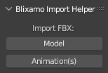

# BLIXAMO

Thanks for checking out this quality of life tool that makes it faster and easier to import Mixamo animations into Blender!

**THE PROBLEM:**

You just viewed the Mixamo website, saw some great animations and excitedly downloaded an animation pack! Then, you imported the animations into Blender and they all ended up with the same name followed by .001, .002, etc...

How are you going to tell animations apart and what are you to do with all of those extraneous and unwanted armatures?

**OVERVIEW:**

This addon automatically gives animations the names of their source FBX files. It also removes extraneous armatures. So, you end up with a clean Outliner and intuitively named animations.

**HOW IT WORKS:**

Install the Blixamo addon.

Then, click the "Blixamo" tab in the 3D Viewport Sidebar. This will reveal the "Blixamo Import Helper" panel. It says, "Import FBX:" and shows 2 buttons:
1. Model
2. Animation(s)

**First:** Click "Model" to import the FBX file that contains your character model and default pose. This will load your model, armature and initial animation, which is probably a T-Pose. It will also rename the animation to the name of the FBX file.

**Second:** Click "Animation(s)" to import the FBX files that contain the desired animations. This will load your animations and delete their extraneous armatures. It will also rename the animations to the names of their respective FBX files.

Once completed, you can view your model and play back the imported animations.

Animations can be viewed in the Action Editor when the armature is selected.

How do you get to the Action Editor? Go to the "Animation" workspace. Then, click on "Dope Sheet" and select "Action Editor" from the popup list.

**LIMITATIONS:**

Don't use the "Model" button more than once or you will end up with multiple armatures and/or models.

You can import more than 1 file at a time with the "Model" button. However, this is NOT RECOMMENDED. It exists as an option for people who know what they're doing. It allows you to import animations and KEEP their armatures.

The default pose animation will be named after its source FBX file, which may or may not be desirable.

Rename the default pose animation to "T-Pose", "A-Pose" or "Default Pose" if preferred. Perhaps, at some point in the future, the addon could automatically rename it to "Default" or some other value if there was enough interest. This could be done when the model was imported.

This tool is not designed to import FBX files that contain more than 1 animation. Mixamo, typically, only includes 1 animation per file. So, under normal circumstances it shouldn't be an issue. Nevertheless, it's good to be aware. Perhaps, a future update could enable the tool to add a numeric sequence to the end of names when 2 or more animations are encountered in the same file.

**TROUBLESHOOTING:**

How can you tell which FBX file contains the character model? Mixamo may give it the same name as the character. The filesize should also be much larger than an animation-only file. Animations are likely to be kilobytes in size while Models are megabytes in size.

What if you accidentally got an unwanted armature in your scene? Select the armature in the Outliner and press DELETE.

What if you accidentally imported the character model using the "Animations" button? Immediately select the model. Then, click "Edit>Undo" or press "ctrl-Z". Finally, re-import using the "Model" button.