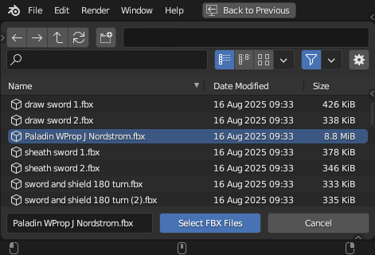

# BLIXAMO

Thanks for checking out this Blender/Mixamo quality of life tool!

## WHAT IS ITS PURPOSE:

You just viewed the Mixamo website, saw some great animations and excitedly downloaded an animation pack! Then, you imported the animations into Blender and they all ended up with the same name followed by .001, .002, etc...

How are you going to tell animations apart and what are you to do with all of those extraneous and unwanted armatures?

This addon automatically gives animations the names of their source FBX files. It also removes extraneous armatures. So, you end up with a clean Outliner and intuitively named animations.

## HOW TO USE IT:

Install the Blixamo addon. (See instructions below.)

Then, click the "Blixamo" tab in the 3D Viewport Sidebar. This will reveal the "Blixamo Import Helper" panel.

**First:** Click "Model" to import the FBX file that contains your character model and default pose. This will load your model, armature and initial animation, which is probably a T-Pose. It will also rename the animation to the name of the FBX file.

**Second:** Click "Animation(s)" to import the FBX files that contain the desired animations. This will add your animations and delete their extraneous armatures. It will also rename the animations to the names of their respective FBX files.

Once completed, you can view your model and play back the imported animations.

Animations are referred to as "Actions" in Blender and they can be viewed in the "Action Editor" **when the armature is selected**.

How do you get to the Action Editor? Go to the "Animation" workspace. Then, click on "Dope Sheet" and select "Action Editor" from the popup list.

## REQUIREMENTS

This addon has been tested in Blender 3.6.1 and 4.5.

## HOW TO INSTALL:

Click the green "Code" button at the top center of the page and choose "Download ZIP". Alternatively, navigate to "Releases>Tags" in the right-hand panel and download the zip file for the latest tag. **THEN**, extract "blixamo_import_helper.py" to your desktop. Next, open Blender, go to "Settings>Add-ons" and...

In older versions of Blender, simply click "Install" and install the file from your desktop.

In newer Blender versions, click the chevron arrow pulldown menu in the upper right corner of the Add-ons panel and choose "Install from disk". Then, install the file from your desktop.

Finally, enable the checkbox next to the newly installed addon in the Add-ons panel.

## LIMITATIONS:

This tool is meant to import MIXAMO FBX FILES. It is not intended for FBX from other sources.

Don't use the "Model" button more than once or you will end up with multiple armatures and/or models.

You can import more than 1 file at a time with the "Model" button. However, this is NOT RECOMMENDED. This capability exists as an option for people who know what they're doing. It allows you to import animations and KEEP their armatures.

The default pose animation will be named after its source FBX file, which may or may not be desirable.

Rename the default pose animation to "T-Pose", "A-Pose" or whatever you prefer. Perhaps, at some point in the future, the addon could automatically rename it to "Default" or some other value if there was enough interest. This could be done when the model was imported.

This tool is not designed to import FBX files that contain more than 1 animation. Mixamo, typically, only includes 1 animation per file. So, under normal circumstances it shouldn't be an issue. Nevertheless, it's good to be aware. Perhaps, a future update could enable the tool to add a numeric sequence to the end of names when 2 or more animations are encountered in the same file.

This tool uses the default settings on Blender's FBX importer. It is possible that the file you are importing may not be suitable for the default settings. Perhaps, in the future, the FBX import settings could be exposed in the UI.

## TROUBLESHOOTING:

How can you tell which Mixamo FBX file contains the character model? The file may have the same name as the character. The filesize should also be much larger than an animation-only file. Animations are likely to be kilobytes in size while Models are megabytes in size.

In the image below, the character model is 8.8MB while the animation files are all less than 500KB. Plus, the animation file names are all representative of actions. Thus, it's easy to see that "Paladin WProp J Nordstrom.fbx" is the character model.

Testing was performed with Mixamo animations that were downloaded using the default settings. If you changed the defaults, then you may potentially encounter problems. Make sure to download with the default settings.

What if you accidentally got an unwanted armature in your scene? Select the armature in the Outliner and press DELETE.

What if you accidentally imported the character model using the "Animations" button? Immediately select the model. Then, click "Edit>Undo" or press "ctrl-Z". Finally, re-import using the "Model" button.
